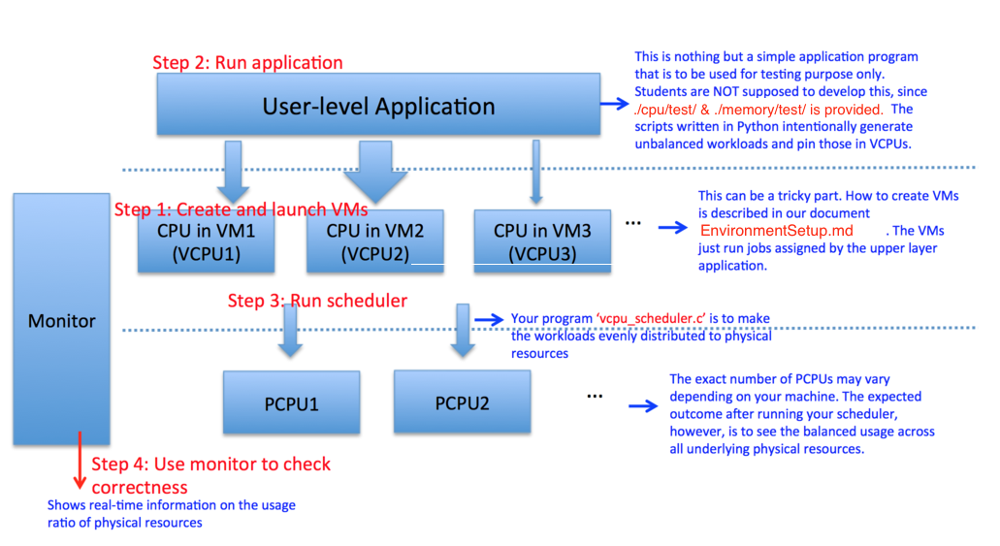

# Project 1 : VM CPU scheduler and Memory Coordinator
---

Please read through the entire page, before getting started. You may create a **PRIVATE** github repository on [GT github](github.gatech.edu) to render this README.md 

## Big Picture

In this project, you are going to implement a vCPU scheduler and a memory coordinator to dynamically manage the resources assigned to each guest machine. Each of these programs will be running in the host machine's user space, collecting statistics for each guest machine through hypervisor calls and taking proper actions. 

During one interval, the vCPU scheduler should track each guest machine's vCpu utilization, and decide how to pin them to pCpus, so that all pCpus are "balanced", where every pCpu handles similar amount of workload. The "pin changes" can incur overhead, but the vCPU scheduler should try its best to minimize it. 

Similarly, during one interval, the memory coordinator should track each guest machine's memory utilization, and decide how much extra free memory should be given to each guest machine. The memory coordinator should set the memory size of each guest machine and trigger the balloon driver to inflate and deflate. The memory coordinator should react properly when the memory resource is insufficient. 

Tools that you need:

- `qemu-kvm, libvirt-bin, libvirt-dev` are packages you need to install so that you can launch virtual machines with KVM and develop programs to manage virtual machines.
- [`libvirt`](https://libvirt.org/) is a toolkit providing lots of APIs to interact with the virtualization capabilities of Linux.
- [Virtualization](https://ubuntu.com/server/docs/virtualization-introduction) is a page you should check.
- `virsh, uvtool, virt-top, virt-clone, virt-manager, virt-install` are tools that may help you play with virtual machines.
- `script` command to make a typescript of your terminal session and generate a log file.

## Deliverables

You need to implement two separate C programs, one for vCPU scheduler (`/cpu/src/vcpu_scheduler.c`) and another for memory coordinator(`/memory/src/memory_coordinator.c`). Both programs should accept one input parameter, the time interval (in seconds) your scheduler or coordinator will trigger. For example, if we want the vCPU scheduler to take action every 2 seconds, we will start your program by doing `./vcpu_scheduler 2`. Note that the boiler plate code is provided in the attached zip file. 

You need to submit one zipped file named `FirstName_LastName_p1.zip` (e.g. `George_Burdell_p1.zip`) containing two separate subfolders(cpu and memory), each containing a `Makefile`, `Readme.md` (containing code description and algorithm), source code and the log files generated through `script` command for each test case. Use the script `collect_submission.py` to generate the zip file. 

We will compile your program by just doing `make`. Therefore, your final submission should be structured as follows after being unzipped. Don’t change the name of the files. Please adhere to the submission instructions, not doing so will result in a penalty of points. 


```
- FirstName_LastName_p1
-  cpu
      - vcpu_scheduler.c
      - Makefile
      - Readme.md (Code Description and algorithm) 
      - 3 vcpu_scheduler.log files - vcpu_scheduler1.log and so on for each test case 
- memory
     -  memory_coordinator.c
     -  Makefile 
     -  Readme.md (Code Description and algorithm) 
     -  3 memory_coordinator.log files - memory_coordinator1.log and so on for each test case
```

You will submit your zip file on gradescope. In the interest of being fair to all students, please refrain from using the gradescope environment as your developing environment as this will affect your fellow students' ability to submit. To this end, there is a modest limit of *20 submissions per user* (enforced manually by the teaching team after the deadline).

Each submission will take around 40 minutes to autograde during off-peak hours, so be advised to submit early!

## Grading

This is not a performance-oriented project, we will test the _functionality only_. Please refer to the [sample output pdf](./res/sample-sol-1.pdf) to understand the expected behavior from the scheduler and coordinator across test cases on the autograder. More details can be found in the test directories described in the [testing section](#testing-process)

The Rubric will be: 
1. vCPU scheduler functionality - 6 points
    - The scheduler should aim to make the pCPUs enter a stable and a balanced state
    - 1 point for Readme
    - 1 points for first 3 test cases whose implementation is available
    - 4 for the remaining 4 test cases.
2. memory coordinator functionality - 6 points
    - The VMs should consume or release memory appropriately for each test case
    - Don't kill the guest operating system (Do not take all the memory resource from guests)
    - Don't freeze the host (Do not give all available memory resources to guests)
    - 5 points for implementation (1.25 per test case) and 1 point for Readme

## Step by Step 
---

### Which environment I should use to develop?
1. We have already configured the required environment in the Vagrantfile in the attached zip file. EnvironmentSetup.md (section: Setting Up Your Environment) gives instructions on how to setup the environment with [Vagrant](https://www.vagrantup.com/downloads) and [VirtualBox](https://www.virtualbox.org/wiki/Downloads). 
2. You need to make sure you have at least 6GB RAM, and 4 physical cores. The default ssh login info for the Vagrant VM: username: vagrant, password: vagrant.
*Warning*: If you want to setup your own environment and choose not to follow the instructions above, you should ensure that your machine's or VM's setting match the one specified in the Vagrantfile, and that you have the right packages installed.
3. [EnvironmentSetup.md](./EnvironmentSetup.md) will also help you create the VMs on the KVM hypervisor.


### Testing Process

Refer to the flowchart below to help understand the overall project concept. We are taking the CPU scheduler as an example here.



1. For testing CPU scheduler, follow directions in [./cpu/test/HowToDoTest.md](./cpu/test/HowToDoTest.md). This includes 3 test cases; detailed scenario and expected outcome for each case is found in [./cpu/test/README.md](./cpu/test/README.md).
2. For testing memory coordinator, follow directions [./memory/test/HowToDoTest.md](./memory/test/HowToDoTest.md). This describes three test cases; detailed scenario and expected outcome for each case is in [./memory/test/README.md](./memory/test/README.md).

> In the autograder environment, we will use up to 4 VMs for memory coordinator tests and 8 VMs for the vcpu scheduler tests. 


### Where can I find the APIs I might need to use?
1. [`libvirt-domain`](https://libvirt.org/html/libvirt-libvirt-domain.html) provides APIs to monitor and manage the guest virtual machines.
2. [`libvirt-host`](https://libvirt.org/html/libvirt-libvirt-host.html) provides APIs to query the information regarding host machine.
 
### VCPU Scheduler

1. The first thing you need to do is to connect to the Hypervisor, `virConnect*` functions in `libvirt-host` are what you need to check. In our project, please connect to the local one which is `qemu:///system`.
2. Next, you need to get all active running virtual machines within `qemu:///system`, `virConnectList*` functions will help you.
3. You are ready to collect VCPU statistics, to do this you need `virDomainGet*` functions in `libvirt-domain`. If you also need host pcpu information, there are also APIs in `libvirt-host`.
4. You are likely to get VCPU time in nanoseconds instead of VCPU usage in % form. Think how to transform or use them.
5. You can also determine the current map (affinity) between VCPU to PCPU through virDomainGet* functions.
6. Write your algorithm, and according to the statistics, find "the best" PCPU to pin each VCPU.
7. Use `virDomainPinVcpu` to dynamically change the PCPU assigned to each VCPU.
8. Now you have a "one-time scheduler", revise it to run periodically.
9. Launch several virtual machines and launch test workloads in every virtual machine to consume CPU resources, then test your VCPU scheduler.

**Important**

Your algorithm should work independent of the number of vcpus and pcpus.
Configurations consisting of #vcpus > #pcpus, #vcpus = #pcpus and #vcpus < #pcpus should be appropriately handled.
Note that you may not need to specifically handle these cases as a generic algorithm that looks to stabilize processor use would apply equally to all cases.

**What is a balanced schedule?**
No PCPU should be under or over utilized. The standard deviation provides a reasonable metric to measure differences in observations from the mean. We expect the standard deviation to be within 5% of the mean utilization for a balanced schedule. 

**What is a stable schedule?**
The scheduler must not frequently change vcpu-pcpu assignments if it has found an optimal balanced schedule.
 
### Memory Coordinator

1. The first thing you need to do is to connect to the Hypervisor, `virConnect*` functions in `libvirt-host` are what you need to check. In our project, please connect to the local one which is `qemu:///system`.
2. Next, you need to get all active running virtual machines within `qemu:///system`, `virConnectList*` functions will help you.
3. Tricky: to get as much memory statistics as possible, you need `virDomainSetMemoryStatsPeriod` function.
4. Now you are ready to get memory statistics, first think what kind of memory statistics you are expecting to get. Then view `virDomainGet*` and `virDomainMemory*` functions to find those you need.
5. You can also get the host memory information through `virNodeGet*` in `libvirt-host`.
6. Write your algorithm, choose your policy, decide how much extra free memory you should give to each virtual machine according to the numbers you get.
7. Use `virDomainSetMemory` to dynamically change the memory of each virtual machine, which will indirectly trigger balloon driver.
8. Now you have a "one-time scheduler", revise it to run periodically.
9. Launch several virtual machines and launch test workloads in every virtual machine to consume memory resources gradually, then test your memory coordinator.
10. Generating log file using `script`

The `script` command is used to record the terminal session and store in a log file. Students must record the results of the monitor test (monitor.py) while running test cases of the pertaining program on another terminal. Test cases can be found in the testing suite mentioned in the [Testing Process](#testing-process) section. In other words, execute the following commands sequentially :-

1. `script` `vcpu_scheduler1.log` or `memory_coordinator1.log`
2. `python3 monitor.py -t runtest1.py`  (vcpu or memory) (3 test cases each for cpu and memory) 
3. Run your scheduler/coordinator program on another terminal
4. exit the `script` and check if you have got satisfying results on your monitor and repeat for next test case

On exiting, the log file will be generated and stored in the current directory. More information can be found by running `man script` on your terminal.

Make sure to generate separate log files for each of the test cases. We recommend you reboot your VMs before running each test for better judgment of monitor results. 

### Directory layout
- This directory contains a boilerplate code, testing framework and example applications for evaluating the functionality of your CPU Scheduler and Memory Coordinator. 
- The boiler plate code is provided in */cpu/src/* and */memory/src/* folders.
- Details for testing the CPU Scheduler can be found in *cpu/test/* folder and details for testing the Memory Coordinator can be found in the *memory/test/* folder.

### Submission

1. To ensure that all the required files are present in your zip submission, run the following command:

```
python3 collect_submission.py 
```
2. The final zip file will include the `src` folder of both cpu and memory folders. Please submit this zip file to gradescope as described above in [Deliverables](#deliverables)
